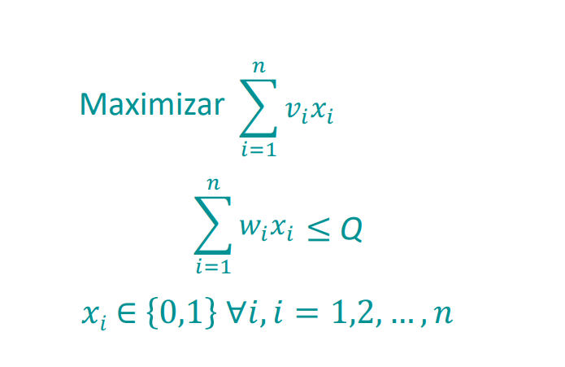

# Knaspack-problem-Greedy-
Knaspack problem resuelto mediante algoritmo codicioso. 

# Descripcion del problema.

El objetivo de los problemas de empaque es encontrar la mejor manera de empaquetar un conjunto de artículos de tamaños dados en contenedores con capacidades fijas . Una aplicación típica es la carga eficiente de cajas en camiones de reparto. A menudo, no es posible empacar todos los artículos debido a las limitaciones de capacidad. En ese caso, el problema es encontrar un subconjunto de artículos con el tamaño total máximo que quepa en los contenedores.

En el problema de la mochila simple, hay un solo contenedor (una mochila). Los artículos tienen valores y tamaños, y el objetivo es empacar un subconjunto de artículos que tenga el valor total máximo.Para el caso especial en el que el valor es igual al tamaño, el objetivo es maximizar el tamaño total de los artículos empaquetados.

# Formulación matemática 

Modelo matemático para el problema de la mochila

  

